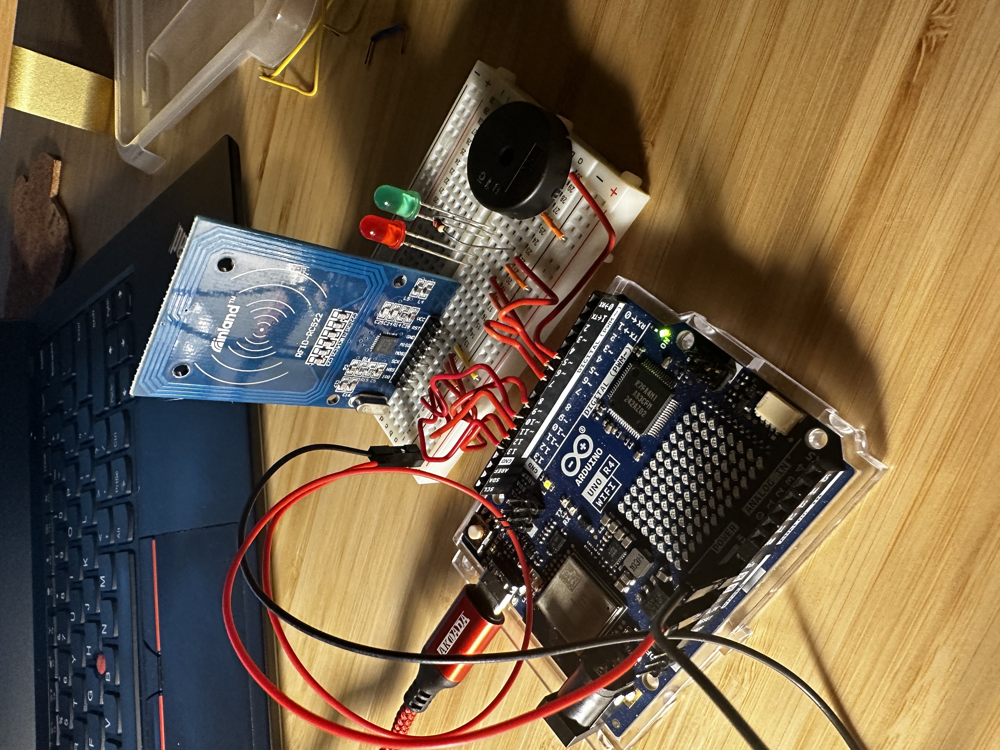

# 🔐 Arduino RFID Authenticator (R4 WiFi + RC522)

This project is a simple RFID authentication system built using an **Arduino R4 WiFi**, an **RC522 RFID module**, and basic components like LEDs and a buzzer. It reads RFID card data and provides authentication feedback using a green LED and success tones (if authorized) or a red LED and error tones (if unauthorized).

## 🛠️ Hardware Used

- **Arduino R4 WiFi**
- **RC522 RFID Module**
- **Red LED**
- **Green LED**
- **Buzzer**
- **Jumper Wires & Breadboard**

## 📷 How It Works

When an RFID card is brought near the RC522 reader:

1. The card's UID (Unique Identifier) is read via the SPI protocol.
2. The UID is compared to a predefined `authorizedUID`.
3. Depending on the result:
   - ✅ If the UID matches:
     - Green LED turns on briefly
     - Buzzer plays two high-pitched success tones
   - ❌ If the UID doesn't match:
     - Red LED blinks 3 times
     - Buzzer plays low-pitched error tones

### 🧠 Logic Overview

```text
Loop:
 ├── Check for new RFID card
 ├── Read UID
 ├── Compare to authorized UID
 │    ├── If match → successAuth()
 │    └── Else → failAuth()
 └── Halt reading, wait briefly
```

## 🔧 Pin Configuration

| Component  | Arduino Pin |
| ---------- | ----------- |
| RC522 SDA  | 10 (SS)     |
| RC522 RST  | 9           |
| RC522 MOSI | 11 (SPI)    |
| RC522 MISO | 12 (SPI)    |
| RC522 SCK  | 13 (SPI)    |
| Green LED  | 6           |
| Red LED    | 7           |
| Buzzer     | 5           |

## 💾 Code Summary

- **Authorized UID:**

  ```cpp
  byte authorizedUID[][4] = {
  {0xAA, 0x98, 0x85, 0xB1},
  {0xAA, 0xAA, 0xAA, 0xAA},
  {0xAA, 0xAA, 0xAA, 0xAA}
   };
  ```

  Change this array to match your desired RFID card's UID.

- **Authentication Functions:**
  - `checkUID()` — compares scanned UID with the authorized one.
  - `successAuth()` — lights green LED and beeps twice.
  - `failAuth()` — blinks red LED and beeps 3 times.

## ⚠️ Notes

- The project uses short delays to avoid multiple quick reads (`delay(1500)`).
- There’s a missing 220Ω resistor on the red LED. I just didn't have one so I used a short delay to flash the LED to limit damage. It’s advisable to add one to limit current and prevent damage.

## 🚀 Future Improvements

- Support for multiple authorized cards.
- Store UIDs in EEPROM or external storage.
- Add OLED display for visual feedback.
- WiFi logging or integration with a web server for remote tracking.

## 📷 Demo

### Sorry in advance, the wiring makes it difficult to see who's connected to what :/ 



[▶️ Watch Demo Video](videoRFID.mp4)
